# Laporan Praktikum Sistem Terdistribusi dan Terdesentralisasi

---

| Nama | NIM |
| --- | --- |
| Akili Rafie Hendarto | 255410007 |

---
## Minggu 01 - Install dan Konfigurasi Git
---

## Tujuan Praktikum
Tujuan praktikum adalah agar mahasiswa memahami bagaimana mendowload Git dan cara konfigurasi Git.

## Pembahasan Praktikum

### 1. Persetujuan Lisensi

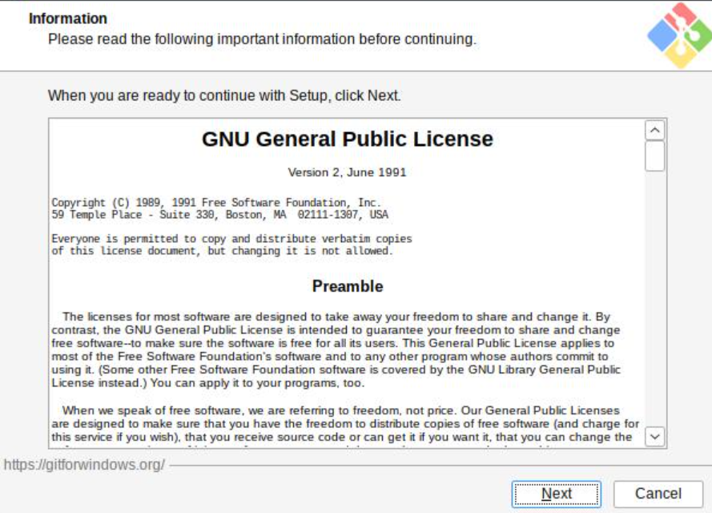
Pembahasan: 
Gambar menunjukkan tahap awal instalasi Git for Windows yang menampilkan lisensi GNU General Public License (GPL). Pengguna perlu membaca dan menyetujui ketentuan lisensi tersebut sebelum melanjutkan instalasi dan Git dapat digunakan secara bebas. 

### 2. Pengaturan Destinasi Lokasi
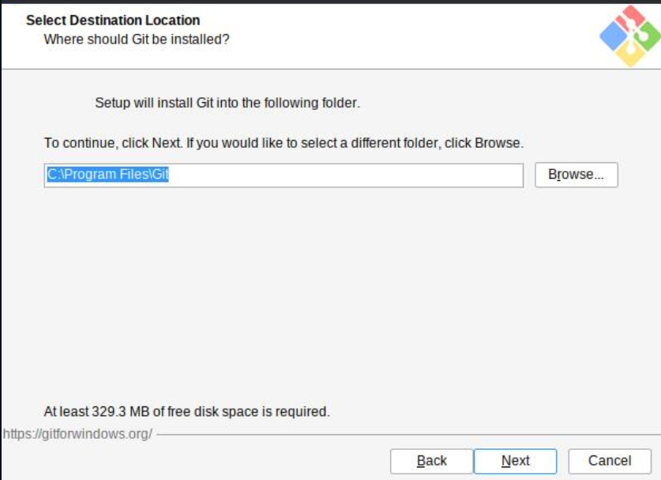
Pembahasan: 
Pada tahap ini ditentukan lokasi penyimpanan program Git di komputer, yaitu direktori instalasi yang akan digunakan oleh sistem. Lokasi bawaan umumnya sudah sesuai untuk sebagian besar pengguna, tetapi dapat diubah apabila diperlukan. Setelah lokasi ditentukan, proses instalasi dapat dilanjutkan.

### 3. Memilih Komponen
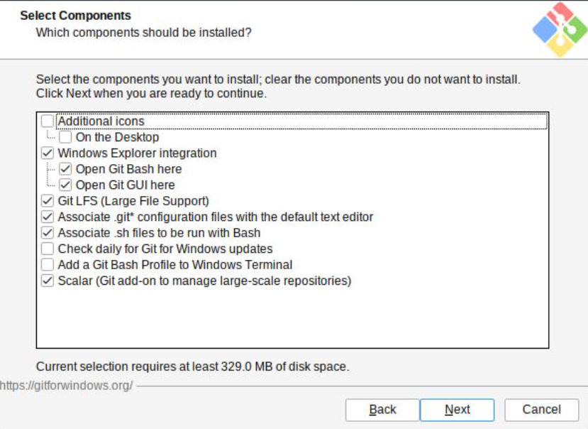
Pembahasan: 
Gambar menampilkan pilihan komponen Git yang akan dipasang, seperti Git Bash, Git GUI, integrasi dengan Windows Explorer, dan dokumentasi. Komponen-komponen tersebut menyediakan antarmuka perintah, antarmuka grafis, serta akses Git melalui menu konteks. 

### 4. Memilih Menu Folder
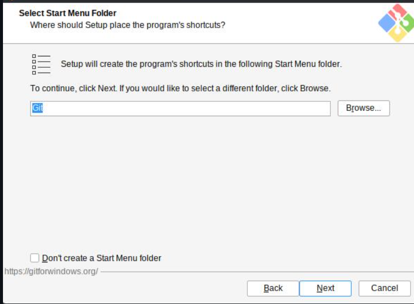
Pembahasan: 
Tahap ini mengatur folder menu Start yang digunakan untuk menempatkan pintasan Git. Nama folder bawaan dapat dipertahankan agar Git mudah ditemukan melalui menu Windows, atau pembuatan pintasan dapat dinonaktifkan jika tidak diperlukan. 

### 5. Memilih Default Editor
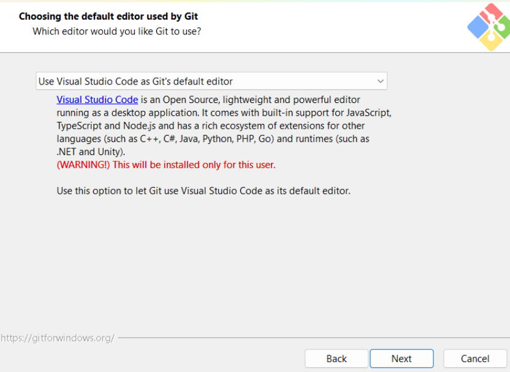
Pembahasan: 
Pada tahap pemilihan editor bawaan, Git meminta aplikasi yang digunakan untuk menulis pesan commit dan melakukan pengeditan tertentu. Pemilihan editor yang tepat mendukung pencatatan perubahan secara jelas dan konsisten.

### 6. Mengatur Nama Branch
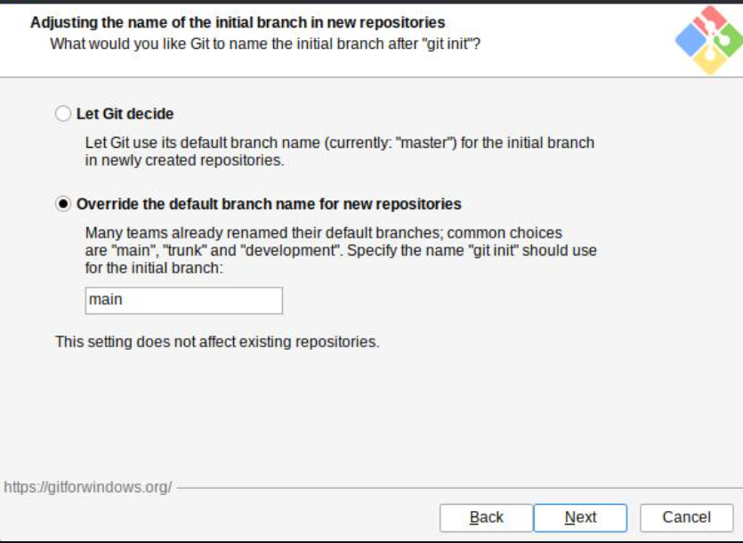
Pembahasan: 
Gambar menampilkan pengaturan nama branch awal pada repository baru. Pilihan untuk menggunakan nama branch bawaan atau menentukan nama utama secara eksplisit dapat disesuaikan dengan standar yang digunakan, misalnya main.

### 7. Mengatur PATH
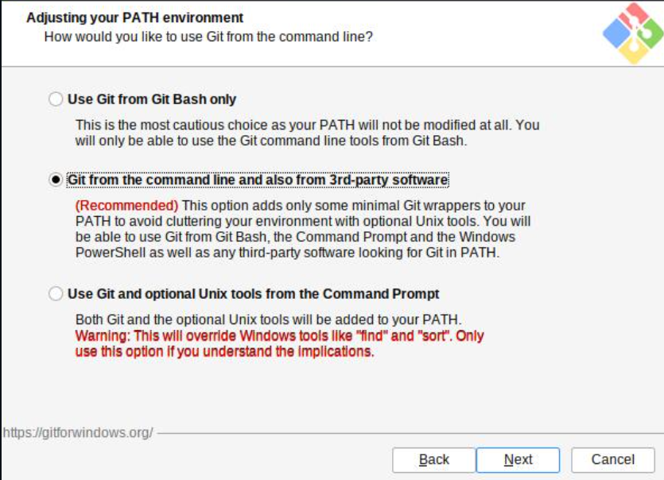
Pembahasan:
Pada tahap ini ditentukan cara Git ditambahkan ke variabel lingkungan PATH. Opsi yang direkomendasikan memungkinkan Git digunakan melalui Git Bash, Command Prompt, PowerShell, maupun aplikasi lain yang membutuhkan perintah Git. Konfigurasi ini membuat operasi version control lebih fleksibel tanpa harus berpindah ke folder instalasi Git.

### 8. Memilih HTTPS Transport Backend
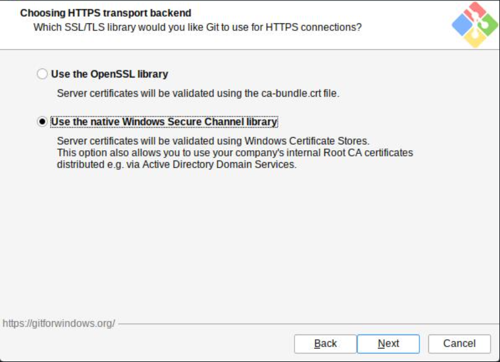
Pembahasan: 
Gambar menunjukkan pemilihan backend transport HTTPS yang digunakan Git untuk berkomunikasi dengan repository jarak jauh. OpenSSL merupakan pilihan umum karena mendukung koneksi terenkripsi dan kompatibel dengan berbagai layanan Git.

### 9. Menentukan Kalimat Akhir
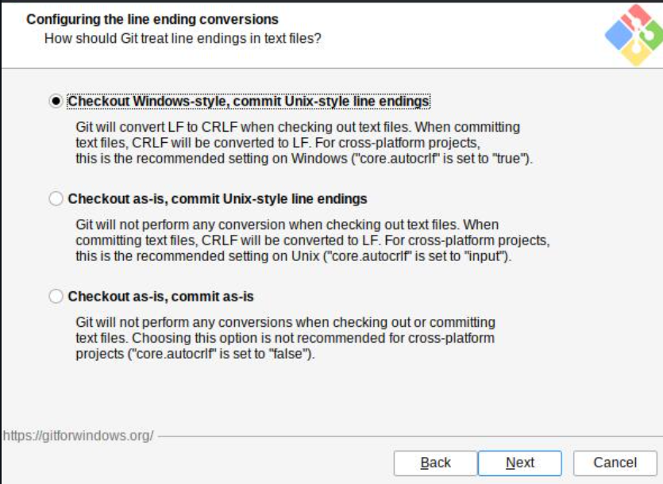
Pembahasan: 
Tahap ini mengatur cara Git menangani karakter akhir baris pada file teks, terutama ketika repository digunakan pada sistem operasi yang berbeda. Opsi yang umum dipilih adalah mengonversi line ending saat checkout dan mengembalikannya ke format yang sesuai saat commit.

### 10. Memilih Terminal
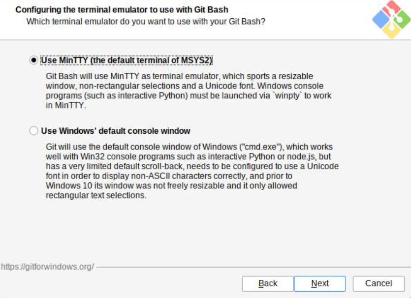
Pembahasan: 
Pada tahap pemilihan terminal, Git menentukan aplikasi terminal yang digunakan oleh Git Bash. MinTTY biasanya dipilih karena menyediakan lingkungan terminal yang nyaman dan mendukung fitur antarmuka Unix, sedangkan konsol Windows dapat digunakan untuk integrasi dengan terminal bawaan.

### 11. Menentukan Git Pull
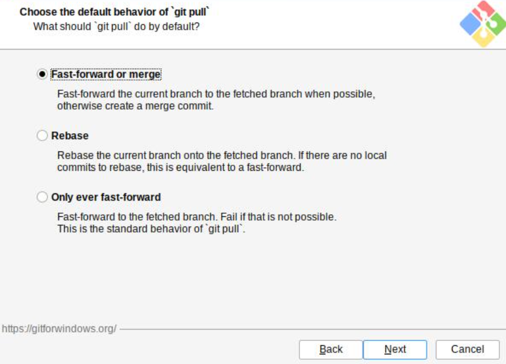
Pembahasan: 
Gambar menampilkan konfigurasi perilaku git pull, yaitu proses mengambil perubahan dari repository jarak jauh dan menggabungkannya ke branch lokal. Opsi default umumnya menggunakan fast-forward atau merge sesuai kondisi repository, sehingga aman bagi pengguna pemula dan tetap mengikuti alur kerja Git.

### 12. Memilih Pengaturan Tambahan
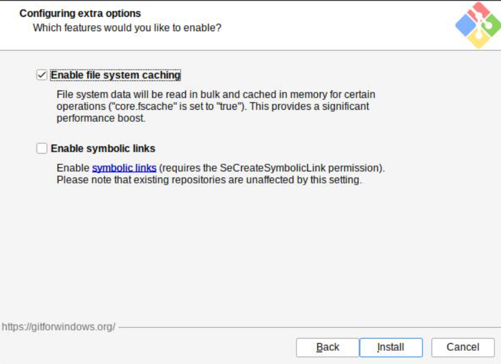
Pembahasan: 
Tahap ini menyediakan pengaturan tambahan seperti penggunaan Git Credential Manager, caching file system, dan symbolic link. Credential Manager membantu menyimpan kredensial secara lebih praktis, sedangkan caching dapat meningkatkan kinerja Git pada repository berukuran besar. 

### 13. Install Git
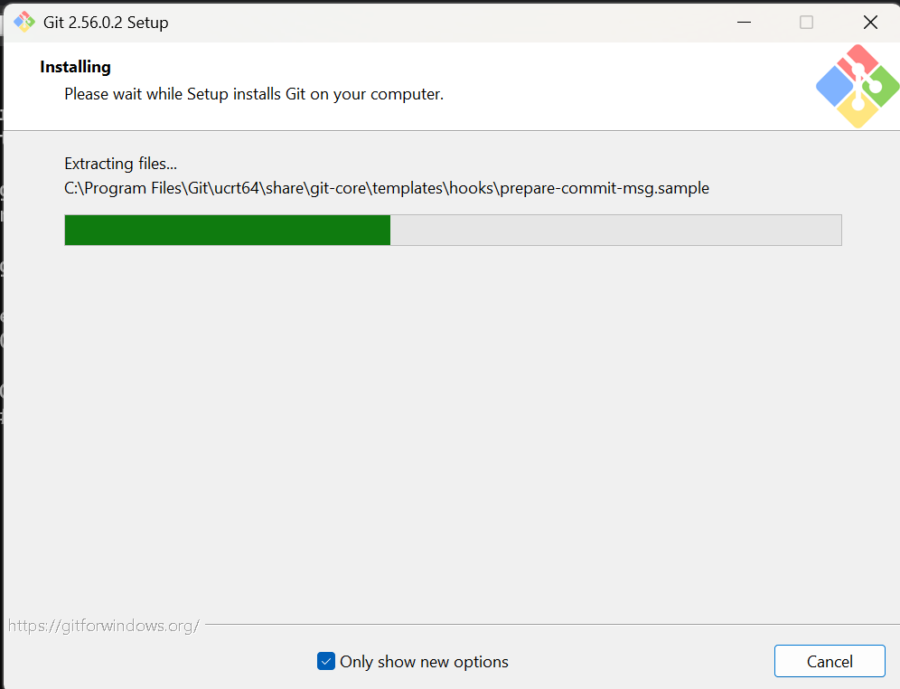
Pembahasan: 
Setelah seluruh pilihan instalasi ditentukan, pengguna menekan tombol Install untuk menyalin berkas program dan menerapkan konfigurasi Git ke sistem. Proses ini memasang komponen yang telah dipilih beserta utilitas pendukungnya. 

### 14. Selesai Install
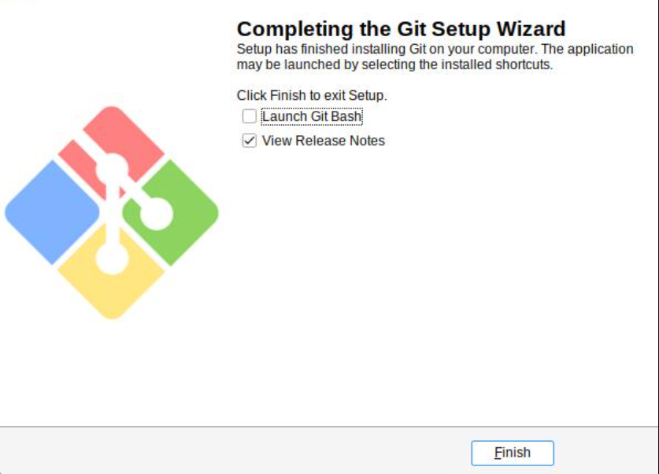
Pembahasan: 
Gambar menunjukkan bahwa instalasi Git telah selesai dan installer memberikan pilihan untuk menjalankan Git Bash atau membaca catatan rilis. Pengguna dapat menutup installer setelah memastikan tidak ada pesan kesalahan. Dengan demikian, Git for Windows telah tersedia dan siap digunakan untuk membuat, mengelola, serta menyinkronkan repository.

### 15. Tes Git
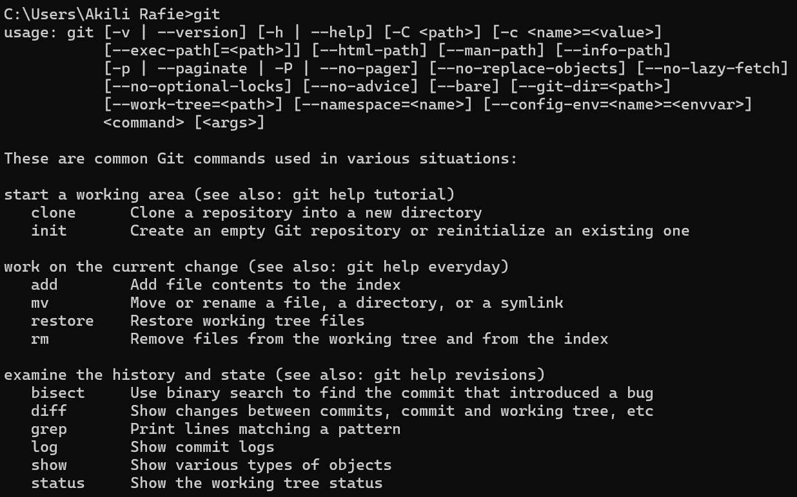
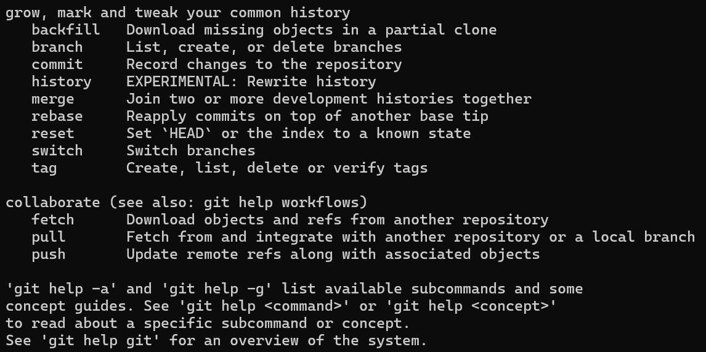
Pembahasan: Pengujian dilakukan melalui terminal dengan menjalankan perintah git --version dan/atau perintah dasar Git untuk memastikan instalasi berhasil. Munculnya nomor versi menunjukkan bahwa executable Git telah dikenali oleh sistem dan PATH telah dikonfigurasi dengan benar.

### 16. Konfigurasi Git
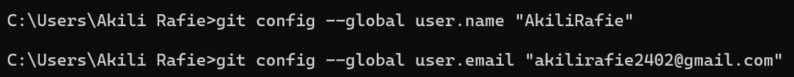
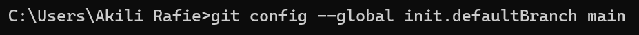
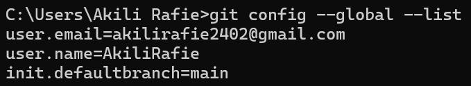
Pembahasan: 
Konfigurasi Git dilakukan dengan menetapkan identitas pengguna melalui perintah git config --global user.name dan git config --global user.email. Informasi tersebut akan dicatat pada setiap commit sehingga kontribusi dapat dikenali dan riwayat perubahan dapat ditelusuri. Pengaturan global berlaku untuk seluruh repository pada komputer, sehingga nama dan alamat email harus diisi dengan identitas yang benar serta konsisten.

### 17. Konfigurasi List
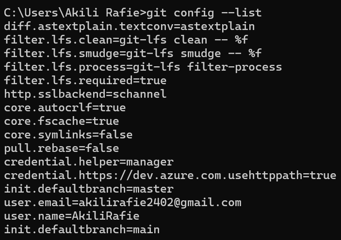
Pembahasan: Perintah git config --list digunakan untuk menampilkan seluruh konfigurasi Git yang aktif, termasuk nama pengguna, email, editor, dan pengaturan lainnya. Hasilnya digunakan untuk memeriksa apakah konfigurasi pada tahap sebelumnya telah tersimpan sesuai harapan.

---

## Kesimpulan
Praktikum minggu pertama berhasil mengenalkan proses instalasi dan konfigurasi Git sebagai dasar pengelolaan versi pada sistem terdistribusi dan terdesentralisasi. Setiap pilihan instalasi, mulai dari lokasi program, komponen, editor, branch, PATH, keamanan HTTPS, terminal, hingga perilaku pull, memengaruhi kemudahan, keamanan, dan konsistensi penggunaan Git. Pengujian versi membuktikan bahwa Git telah terpasang dan dapat dipanggil melalui terminal, sedangkan konfigurasi identitas serta pemeriksaan daftar konfigurasi memastikan setiap commit memiliki informasi pengembang yang jelas.